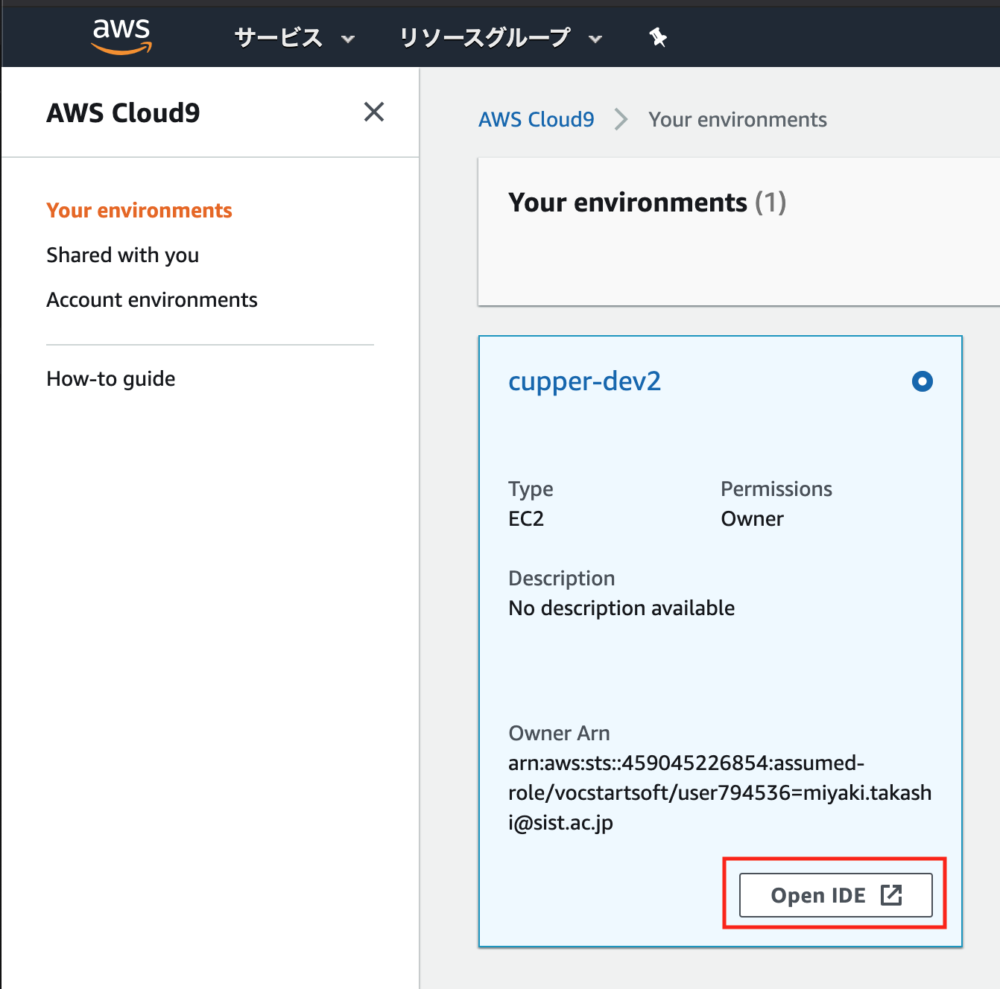
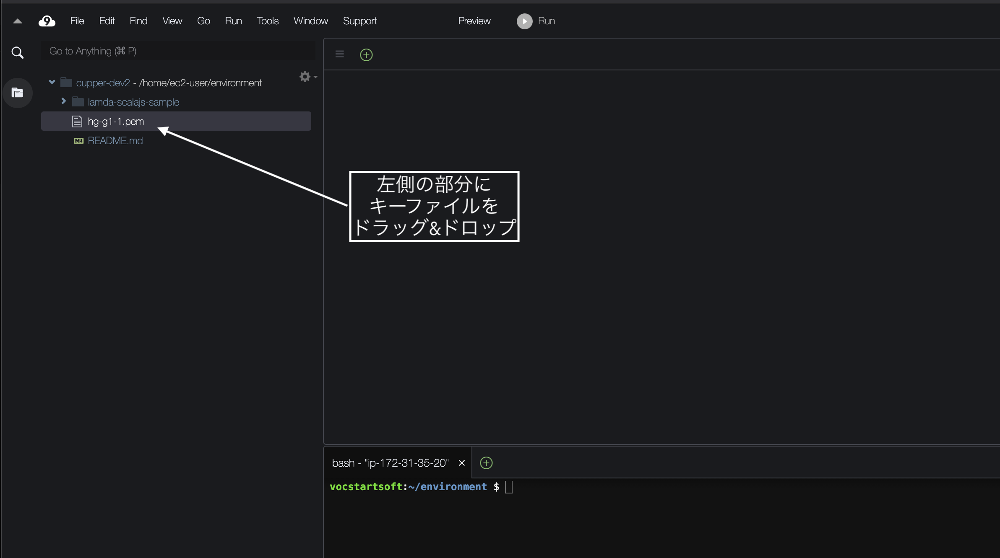
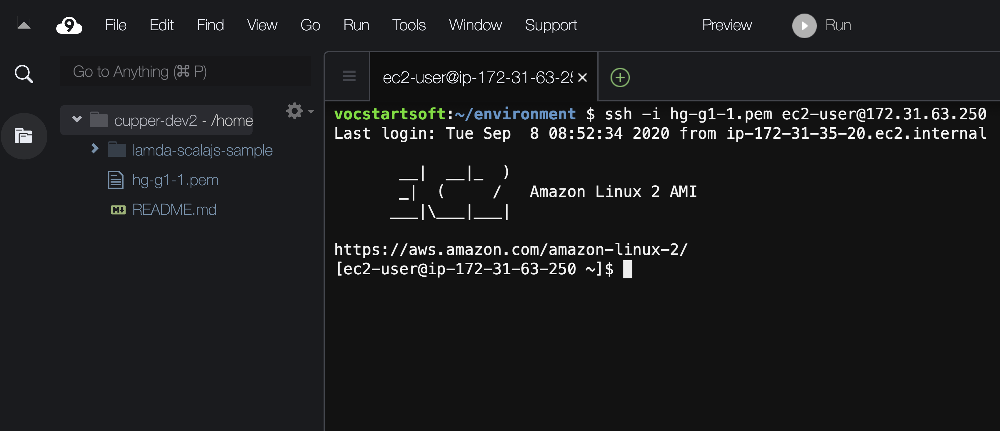
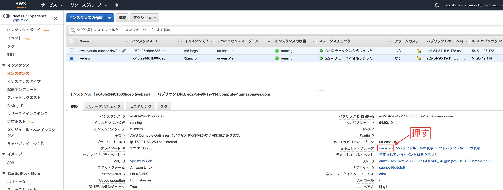
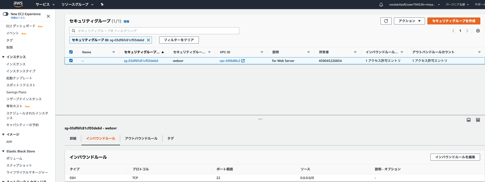
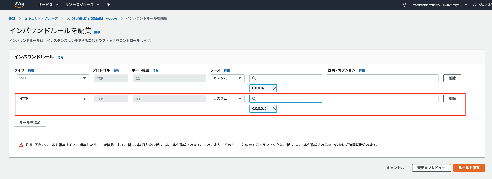
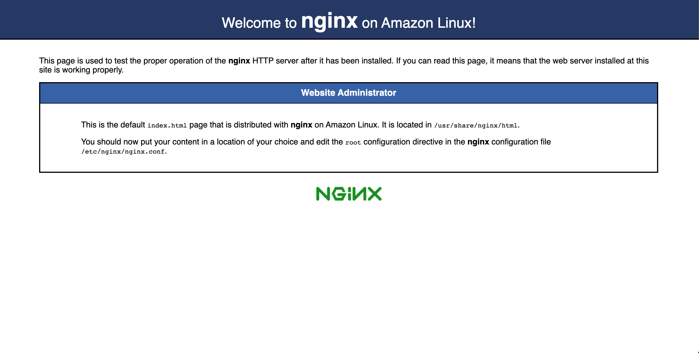

# クラウドコンピューティングとは
クラウドコンピューティングとは、コンピュータの機能や処理能力、ソフトウェア、データなどをインターネットなどの通信ネットワークを通じてサービスとして呼び出して遠隔から利用すること。

[参照](http://e-words.jp/w/%E3%82%AF%E3%83%A9%E3%82%A6%E3%83%89%E3%82%B3%E3%83%B3%E3%83%94%E3%83%A5%E3%83%BC%E3%83%86%E3%82%A3%E3%83%B3%E3%82%B0.html)

この授業では利用者がアプリケーションを運用するためのリソースを提供するサービスをコンピューティングと定義する。

## AWSが提供するリソース
[参照](https://aws.amazon.com/jp/)

## [Amazon EC2](https://aws.amazon.com/jp/ec2/)
Amazon Elastic Compute Cloud (Amazon EC2) は、安全でサイズ変更可能なコンピューティング性能をクラウド内で提供するウェブサービス

### 操作方法
EC2を操作する方法は以下の通り
* [Management console](https://aws.amazon.com/jp/console/)
* [CLI(Command line interface)](https://docs.aws.amazon.com/cli/latest/reference/ec2/)
* [API(Application interface)](https://docs.aws.amazon.com/AWSEC2/latest/APIReference/Welcome.html)

#### CLI
* example
  * インスタンス作成
  ```
  IMAGE_ID=ami-02354e95b39ca8dec
  KEY_NAME=cupper
  SG_ID=sg-2ef35709
  SUBNET_ID=subnet-2eab7871

  aws ec2 run-instances \
  --image-id ${IMAGE_ID} \
  --count 1 \
  --instance-type t2.micro \
  --key-name ${KEY_NAME} \
  --security-group-ids ${SG_ID} \
  --subnet-id ${SUBNET_ID}
  ```

  * インスタンス削除
  ```
  INSTANCE_ID=i-0bff71cb84f78aa96

  aws ec2 terminate-instances --instance-ids ${INSTANCE_ID}
  ```

## [演習1] EC2インスタンスでWebサーバを立ち上げる
### EC2インスタンス作成
以下の設定でEC2インスタンスを作成する
* AMI: Amazon Linux 2 AMI (HVM), SSD Volume Type - 64 ビット (x86)
* インスタンスタイプ: t2.micro
* インスタンスの詳細の設定: デフォルト
* ストレージの追加: デフォルト
* タグの追加: Nameタグを追加する
* セキュリティグループの設定: 新しいセキュリティグループを作成する  
  以下を指定する  
  * セキュリティグループ名
  * 説明

### EC2インスタンスの起動
* キーペアを作成してダウンロードする
  * ダウンロード先は自分のホームディレクトリの下  
  例: C:\Users\MyAccount\Documents

### EC2インスタンスに接続
#### Windowsのコマンドプロンプトから接続する方法

SSHでEC2インスタンスに接続する
``` shell
ssh -i ダウンロードしたキーファイル ec2-user@EC2インスタンスのIPv4 パブリック IP
```

例
``` shell
> ssh -i C:\Users\MyAccount\Documents\mykey.pem ec2-user@100.26.246.124
```

#### Cloud9で接続する方法
1. Cloud9を立ち上げる  
下の画像の「Open IDE」を押す。


2. ダウンロードしたキーファイルをCloud9にアップロード


3. Cloud9からSSHでEC2インスタンスに接続する

``` shell
ssh -i アップロードしたキーファイル ec2-user@EC2インスタンスのIPv4 プライベート IP
```

__注意__ : Cloud9はEC2インスタンスと同一のネットワーク上に存在するので、「パブリックIP」ではなく「プライベートIP」で接続する。



### nginxをインストール

1. nginxをインストールする
```
sudo amazon-linux-extras install nginx1
```

2. nginxを起動する
```
sudo systemctl start nginx
```

`systemctl status`の結果、以下のように表示されればOK

```
[ec2-user@ip-172-31-63-250 ~]$ sudo systemctl status nginx
● nginx.service - The nginx HTTP and reverse proxy server
   Loaded: loaded (/usr/lib/systemd/system/nginx.service; disabled; vendor preset: disabled)
   Active: active (running) since Tue 2020-09-08 09:06:27 UTC; 16s ago
  Process: 1787 ExecStart=/usr/sbin/nginx (code=exited, status=0/SUCCESS)
  Process: 1784 ExecStartPre=/usr/sbin/nginx -t (code=exited, status=0/SUCCESS)
  Process: 1783 ExecStartPre=/usr/bin/rm -f /run/nginx.pid (code=exited, status=0/SUCCESS)
 Main PID: 1790 (nginx)
   CGroup: /system.slice/nginx.service
           ├─1790 nginx: master process /usr/sbin/nginx
           └─1791 nginx: worker process

Sep 08 09:06:27 ip-172-31-63-250.ec2.internal systemd[1]: Starting The nginx HTTP and reverse proxy server...
Sep 08 09:06:27 ip-172-31-63-250.ec2.internal nginx[1784]: nginx: the configuration file /etc/nginx/nginx.conf syntax is ok
Sep 08 09:06:27 ip-172-31-63-250.ec2.internal nginx[1784]: nginx: configuration file /etc/nginx/nginx.conf test is successful
Sep 08 09:06:27 ip-172-31-63-250.ec2.internal systemd[1]: Failed to read PID from file /run/nginx.pid: Invalid argument
Sep 08 09:06:27 ip-172-31-63-250.ec2.internal systemd[1]: Started The nginx HTTP and reverse proxy server.
```

3. nginxの自動起動を有効にする
```
sudo systemctl enable nginx
```

### EC2インスタンスのセキュリティグループの設定を変更
1. EC2インスタンスの「説明」からセキュリティグループに移動  
以下の画像の赤で囲んだ部分を押す



2. インバウンドルールにHTTPを追加
以下の画像の「インバウンドルールを編集」を押す



以下の画像の
* 「ルールを追加」を押す
* 赤で囲んだ部分のとおりに情報を入力する
* 「ルールを保存」を押す



### 動作確認
ブラウザからEC2インスタンスのパブリックIPでアクセスして以下の画面が表示されればOK


