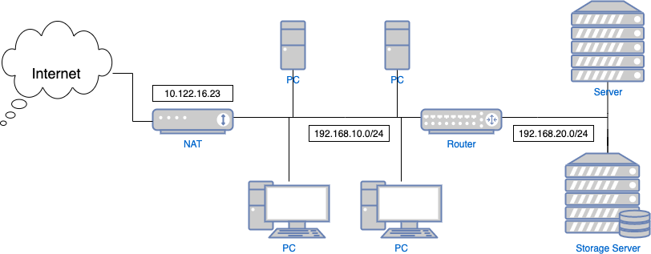

# ネットワーキング
## ネットワークとは

### ネットワーク構成



### [OSI参照モデル](https://ja.wikipedia.org/wiki/OSI参照モデル)

### [IPアドレス](https://ja.wikipedia.org/wiki/IPアドレス)

## AWSのサービス

### ネットワーク構成(AWS)


### [VPC](https://docs.aws.amazon.com/ja_jp/vpc/latest/userguide/what-is-amazon-vpc.html)
* VPCとは
* VPCの仕組み
* IPアドレス指定
* セキュリティ
  * セキュリティグループ
* VPCのネットワーキングコンポーネント
  * ルートテーブル
  * インターネットゲートウェイ
  * NAT

### Route 53

### API Gateway

### CloudFront

## 演習
### ネットワーク構築
* VPC
* インターネットゲートウェイ
* サブネット
  * Public(インターネットからアクセス可能)/Private(インターネットからアクセス不可)
* セキュリティグループ
* ルートテーブル

### サーバ構築
* bastion
* Webサーバ

### Nginxインストール
1. WebサーバにNginxをインストールする

    ```
    $ sudo amazon-linux-extras install nginx1
    ```

2. Nginxを起動

    ```
    $ sudo systemctl start nginx
    ```

3. Nginxの自動起動を有効にする

    ```
    $ sudo systemctl enable nginx
    ```

### PHPインストール
1. WebサーバにNode.jsをインストールする

    ```
    $ sudo amazon-linux-extras install php7.4
    ```

2. php-fpmを起動する

    ```
    $ sudo systemctl start php-fpm
    ```

3. php-fpmの自動起動を有効にする

    ```
    $ sudo systemctl enable php-fpm
    ```

### Nginxの定義ファイルを編集
1. ファイルを編集
* ファイル  
/etc/php-fpm.d/www.conf

* 修正内容
  * 修正前
    ```
    ; Unix user/group of processes
    ; Note: The user is mandatory. If the group is not set, the default user's group
    ;       will be used.
    ; RPM: apache user chosen to provide access to the same directories as httpd
    user = apache
    ; RPM: Keep a group allowed to write in log dir.
    group = apache
    ```
  * 修正後
    ```
    ; Unix user/group of processes
    ; Note: The user is mandatory. If the group is not set, the default user's group
    ;       will be used.
    ; RPM: apache user chosen to provide access to the same directories as httpd
    user = nginx
    ; RPM: Keep a group allowed to write in log dir.
    group = nginx
    ```

2. php-fpm再起動
    ```
    $ sudo systemctl restart php-fpm
    ```

### 動作確認
1. 動作確認要ファイル作成  
以下のファイルを作成する
* ファイル  
/usr/share/nginx/html/phpinfo.php

* 内容
  ```
  <?php
  phpinfo();
  ?>
  ```

2. 動作確認  
Webブラウザから以下のアドレスにアクセスする

    ```
    http://WebサーバのPublic IPアドレス/phpinfo.php
    ```
