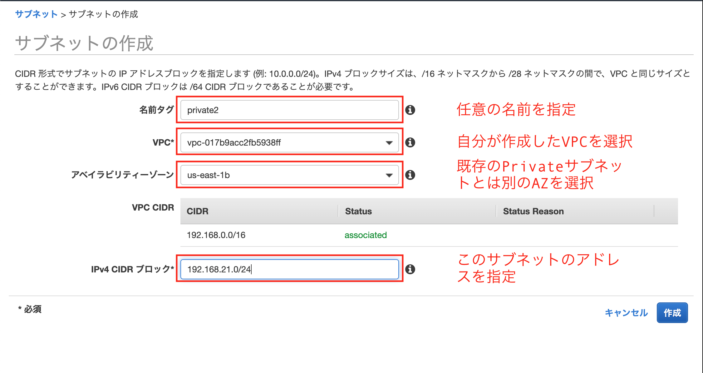
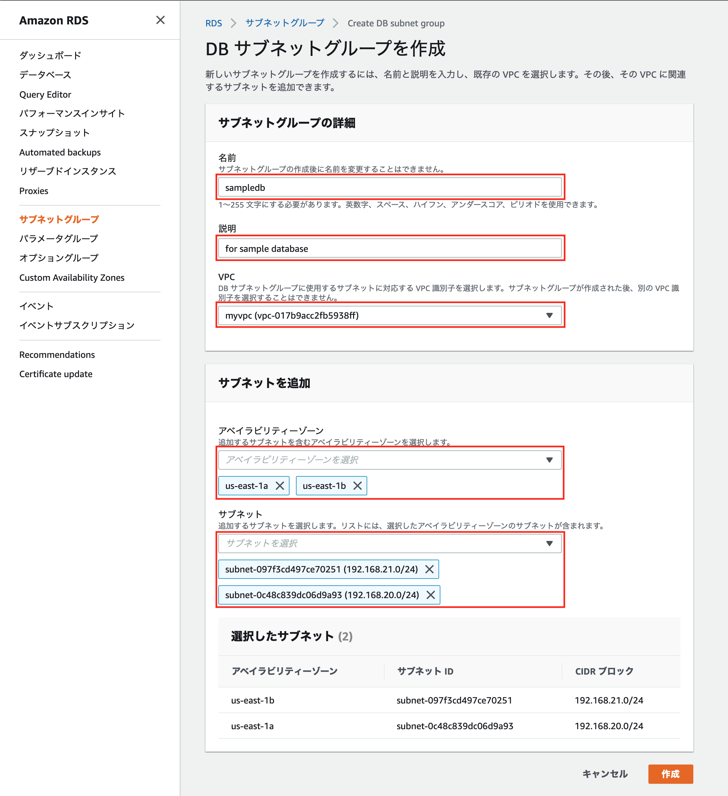
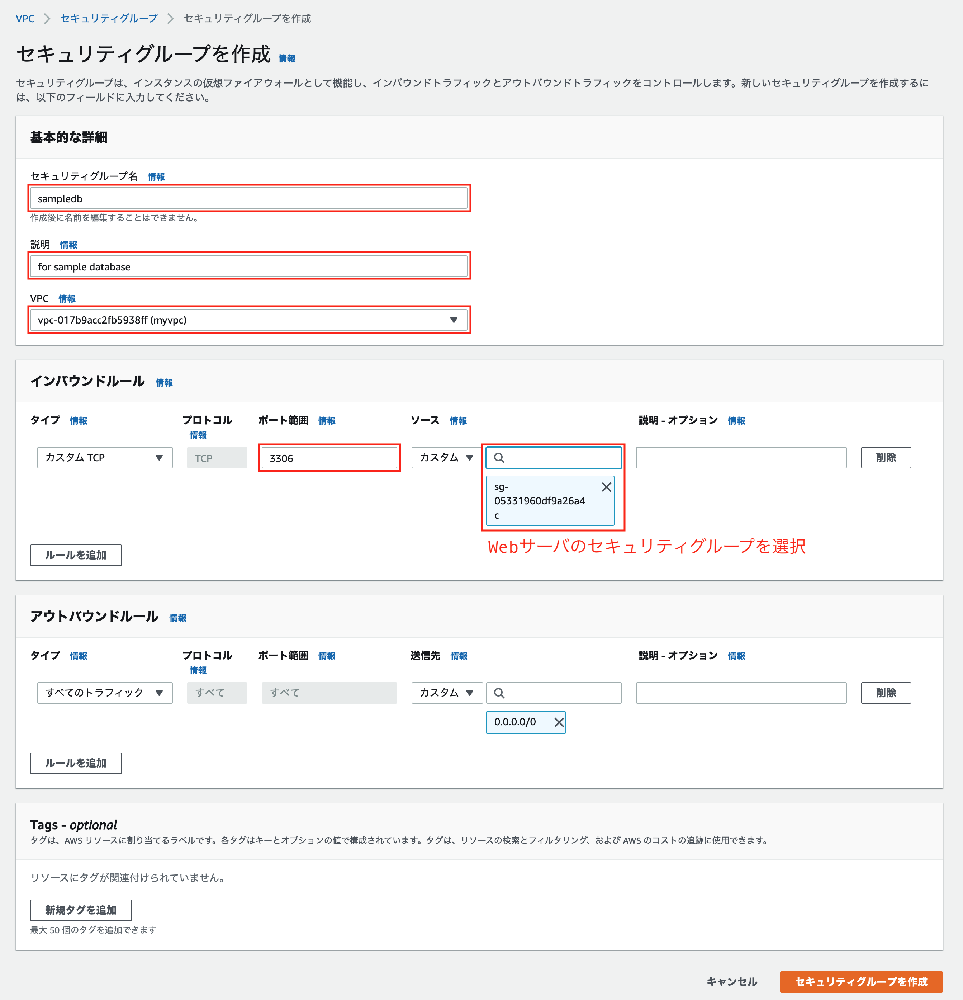
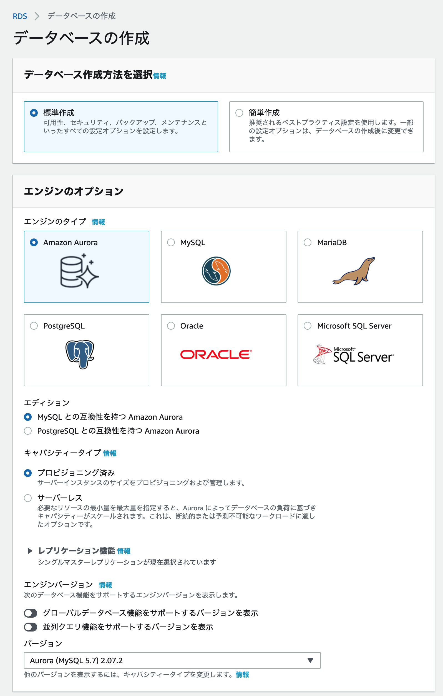
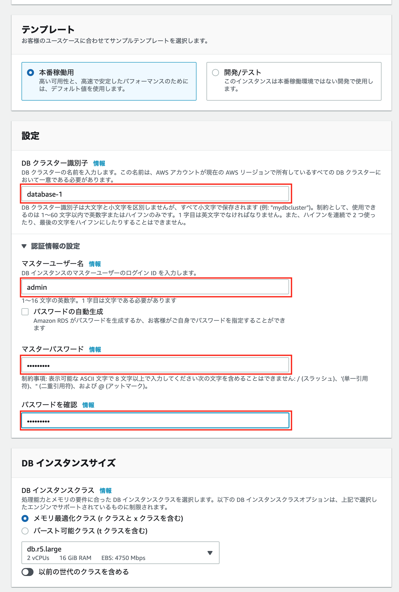
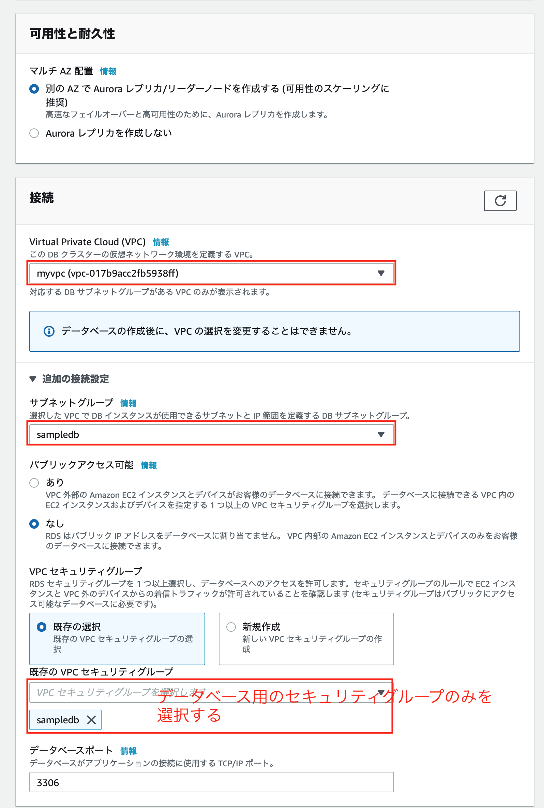
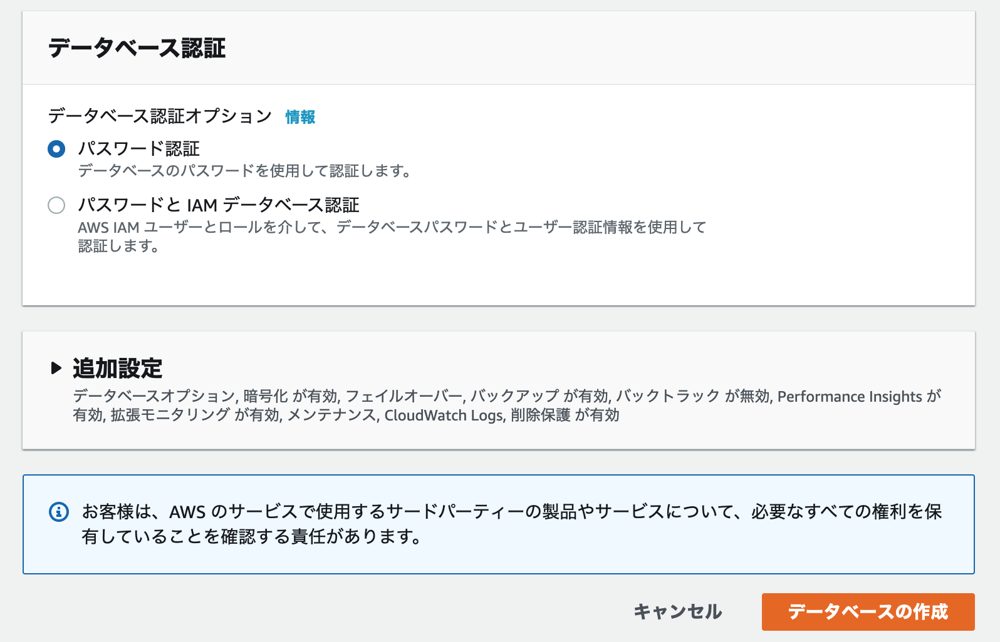
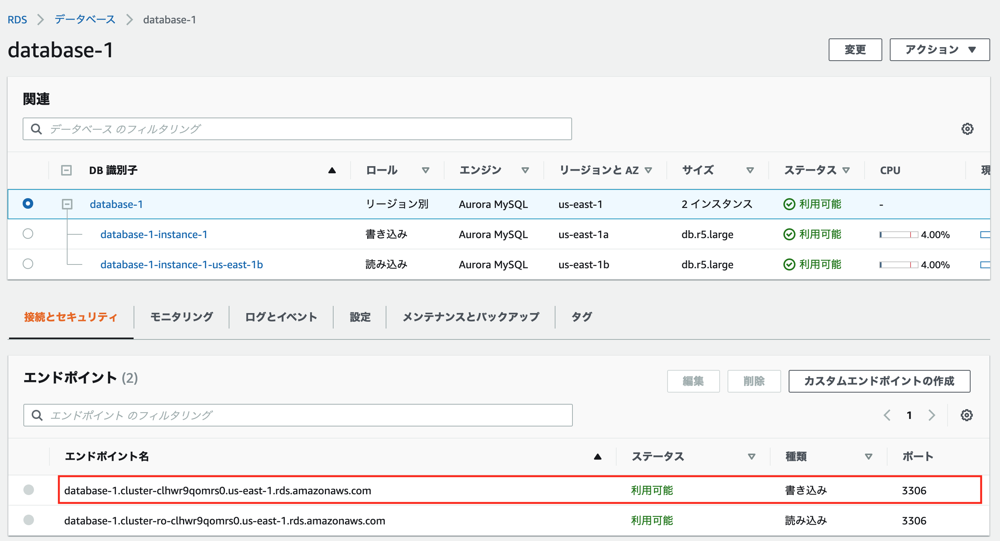

演習

# 内容
Auroraを使用してデータベースを作成して、SQLを使ってデータベースを操作する。

## Auroraとは
* フルマネージド（Aurora 以外も同じ）
* 容易にスケール（Aurora 以外も同じ）
* 従量課金（Aurora 以外も同じ）
* フェールオーバー構成を簡単に実現可能（Aurora 以外も同じ）
* クラウド向けにAWSが構築したRDBサービス
* MySQLとPostgreSQLと互換性あり
* MySQL, PostgreSQLよりも高速（とAWSは言っている）

# 手順
## サブネット作成
Aurora を利用するには別々のアベイラビリティゾーンにまたがったサブネットが、少なくとも2つ必要

「サービス -> VPC」のメニューから「Private サブネット」を追加する。



## サブネットグループ作成
「サービス -> RDS」のメニューから「サブネットグループ」を作成する。

別々のアベイラビリティゾーンに配置した2つのPrivate サブネットを使用してサブネットグループを作成する。



## セキュリティグループ作成
「サービス -> VPC」のメニューからデータベース用のセキュリティグループを作成する。
* Webサーバからデータベースサーバにアクセスできるようにする



## Aurora作成
「サービス -> RDS」のメニューから「データベース」を作成する。






---

## 以降の作業はWebサーバ上で実施する！
1. Cloud 9からbastionサーバにSSHでログイン (Public IP)
2. bastionサーバからWebサーバにログイン (Private IP)

## Databaseのエンドポイントを取得
以下の画像の赤枠の部分をコピーする。



## データベースへの接続確認
mysql コマンドを使用してWebサーバからデータベースに接続できることを確認する。

* コマンド
    ```
    mysql -uユーザーID -pパスワード -hデータベースのエンドポイント
    ```

以下のようになれば接続OK
```
[ec2-user@ip-192-168-10-83 ~]$ mysql -uadmin -pxxxxxxxx -hdatabase-1.cluster-clhwr9qomrs0.us-east-1.rds.amazonaws.com
mysql: [Warning] Using a password on the command line interface can be insecure.
Welcome to the MySQL monitor.  Commands end with ; or \g.
Your MySQL connection id is 22
Server version: 5.7.12 MySQL Community Server (GPL)

Copyright (c) 2000, 2020, Oracle and/or its affiliates. All rights reserved.

Oracle is a registered trademark of Oracle Corporation and/or its
affiliates. Other names may be trademarks of their respective
owners.

Type 'help;' or '\h' for help. Type '\c' to clear the current input statement.

mysql> 
```

## mysql client インストール
1. mariadb を削除する  

    ```
    $ sudo yum remove mariadb-libs
    ```

    参考：[mariadb](https://mariadb.com/kb/ja/mariadb/)

2. mysql client をインストーする
    ```
    $ sudo yum localinstall -y https://dev.mysql.com/get/mysql80-community-release-el7-3.noarch.rpm
    $ sudo yum install -y mysql-community-client
    ```

## データベース作成
mysqlのコンソールから以下のSQLを実行する。

[SQL](./create.sql)

以下のように表示されればOK
```
+------------+-----------+-------------+-------+
| first_name | last_name | class_name  | score |
+------------+-----------+-------------+-------+
| Taro       | Suzuki    | Mathematics |    90 |
| Taro       | Suzuki    | English     |    53 |
| Taro       | Suzuki    | Chemistry   |    76 |
| Hanako     | Mochizuki | Mathematics |    67 |
| Hanako     | Mochizuki | Chemistry   |    43 |
| Yuko       | Tanaka    | Mathematics |    55 |
| Yuko       | Tanaka    | English     |    77 |
| Yuko       | Tanaka    | Chemistry   |    66 |
| Tomoko     | Hayashi   | Mathematics |   100 |
| Tomoko     | Hayashi   | English     |    79 |
| Tomoko     | Hayashi   | Chemistry   |    97 |
| Jiro       | Nakata    | Mathematics |    23 |
| Jiro       | Nakata    | English     |    45 |
| Jiro       | Nakata    | Chemistry   |    77 |
+------------+-----------+-------------+-------+
```

## テーブル操作
1. 生徒の名前(first_name, last_name)と平均点を表示してみましょう。  
平均の計算はAVG関数を使います。

2. 50点以下の点数をとった生徒の名前(first_name, last_name)とクラス名、点数を表示してみましょう。
