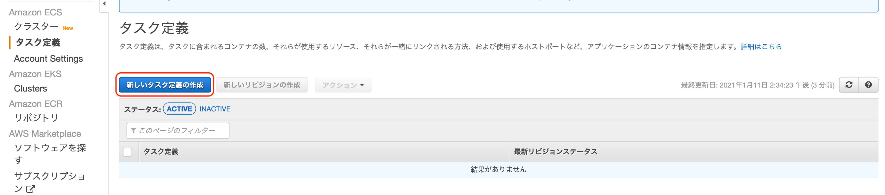

# AWSのコンテナサービスを使ってみる
AWSでコンテナを利用するサービスには、以下がある。
* ECS(Elastic Container Service)
* EKS(Elastic Container Service for Kubernetes)

## • ECS(Elastic Container Service)
AWSが独自に開発したコンテナ管理サービス

## • EKS(Elastic Container Service for Kubernetes)
オープンソースのKubernetesをベースにしたコンテナ管理サービス

# コンテナを動作させる場所
コンテナを動作させる場所には、以下がある。
* EC2
* Fargate

## • EC2
EC2インスタンス上でコンテナを動作させる。

## • Fargate
AWSがインスタンスを管理する。
コンテナ単位で料金が発生する。インスタンス単位での料金は発生しない。

# ECSを使ってみる

## コンテナイメージの作成
__この作業は、Growi(docker container版)を構築したEC2上で実施する__

__前回の授業のdocker-composeでコンテナを起動していればこの作業は不要__

1. 以下のリポジトリをクローン  
`git clone https://github.com/cupperservice/cloud-class-2020-2.git`

2. イメージをビルドする  
__以下のコマンドを、`cloud-class-2020-2/14_container/docker`の下で実施__  
`docker-compose build`

### `docker images`を実施して以下のイメージ(`docker_app`)が表示されればOK
```
docker images
REPOSITORY          TAG                 IMAGE ID            CREATED             SIZE
docker_app          latest              c24271a95474        54 minutes ago      1.65GB
```

## コンテナイメージ登録
コンテナイメージをECR(Elastic Container Repository)に登録する

### 1. ECRのリポジトリ作成
AWS Consoleでリポジトリを作成する


以下の赤枠で囲んだ部分を覚えておく


### 2. イメージのタグ付け
__この作業は、Growi(docker container版)を構築したEC2上で実施する__

`docker tag`コマンドでgrowiのイメージにタグを付ける  
* `docker tag イメージID ECRのURI`

* 実行例
    ```
    docker tag c24271a95474 999775796670.dkr.ecr.us-east-1.amazonaws.com/growi
    ```

#### `docker images`を実施してタグ付けしたイメージが表示されればOK
```
docker images
REPOSITORY                                           TAG                 IMAGE ID            CREATED             SIZE
999775796670.dkr.ecr.us-east-1.amazonaws.com/growi   latest              c24271a95474        3 hours ago         1.65GB
docker_app                                           latest              c24271a95474        3 hours ago         1.65GB
```

### 3. プライベートレジストリの認証
__この作業は、Growi(docker container版)を構築したEC2上で実施する__

以下のファイルに資格情報を保管する
* ファイル: `~/.aws/credentials`
* 資格情報の取得元


以下のコマンドを実行してプライベートレジストリを認証する  
* `aws ecr get-login-password --region us-east-1 | docker login --username AWS --password-stdin ECRのURI`

* 実行例
    ```
    aws ecr get-login-password --region us-east-1 | docker login --username AWS --password-stdin 999775796670.dkr.ecr.us-east-1.amazonaws.com
    ```

### 4. イメージの登録
__この作業は、Growi(docker container版)を構築したEC2上で実施する__

以下のコマンドを実行してイメージをECRに登録する
* `docker push ECRのURI`

* 実行例
    ```
    docker push 999775796670.dkr.ecr.us-east-1.amazonaws.com/growi
    ```

## タスク作成
* ECRのメニューから「新しいタスク定義の作成」を押す


* FARGATEを選択して、「次のステップ」を押す


* 赤枠の箇所を入力し、「コンテナの追加」を押す
  * タスク定義名
  * タスクメモリ
  * タスク CPU


* 赤枠の箇所を入力し、「追加」を押す
  * コンテナ名
  * イメージ
  * ポートマッピング
  * エントリポイント
  * 作業ディレクトリ
  * 環境変数


